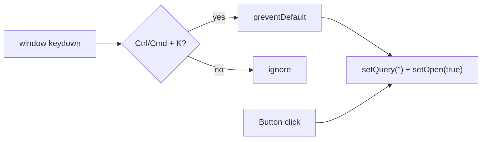

# Search shortcut (Ctrl+K / Cmd+K)

## Goal

Pressing **Ctrl+K** (Windows/Linux) or **Cmd+K** (Mac) anywhere in the app should do the same thing as clicking the search icon in `[header-bar.tsx](frontend/src/components/world/header-bar.tsx)`: clear the query and open the search dialog.

Also show a small shortcut hint on/near the search button (per your preference).

## Current behavior

`[search-button.tsx](frontend/src/components/world/search-button.tsx)` owns dialog state (`open`, `query`). The button click handler:

```ts
setQuery('');
setOpen(true);
```

The project already implements a similar global shortcut in `[custom/sidebar.tsx](frontend/src/components/custom/sidebar.tsx)` (`Ctrl/Cmd + B` for sidebar). Reuse that pattern for consistency.




## Implementation (single file focus)

### 1. Extract shared “open search” logic — `[search-button.tsx](frontend/src/components/world/search-button.tsx)`

- Add `const openSearch = useCallback(() => { setQuery(''); setOpen(true); }, [])`.
- Wire the existing `<Button onClick={...}>` to `openSearch`.

### 2. Register global keyboard shortcut — same file

- Add `useEffect` on `window` (mirror sidebar):

```ts
const SEARCH_KEYBOARD_SHORTCUT = 'k';

useEffect(() => {
  const handleKeyDown = (event: KeyboardEvent) => {
    if (
      event.key.toLowerCase() === SEARCH_KEYBOARD_SHORTCUT &&
      (event.metaKey || event.ctrlKey)
    ) {
      event.preventDefault();
      openSearch();
    }
  };
  window.addEventListener('keydown', handleKeyDown);
  return () => window.removeEventListener('keydown', handleKeyDown);
}, [openSearch]);
```

- Use `event.key.toLowerCase() === 'k'` so both `k` and `K` work with modifiers.
- Call `preventDefault()` to reduce browser defaults (e.g. Chrome focusing the address bar on Ctrl+K).

**No change to `[header-bar.tsx](frontend/src/components/world/header-bar.tsx)`** — shortcut lives next to the state it controls.

### 3. Visible shortcut hint on the button

- Add a compact hint next to the search icon inside the ghost button, e.g.:
  - Desktop: `Ctrl+K` on non-Mac, `⌘K` on Mac (detect once via `navigator.platform` / `userAgent` in a small helper or `useMemo` on mount).
  - Mobile: hide the hint (`hidden sm:inline` ) so the bottom header bar stays uncluttered.
- Style: muted text, small size (`text-xs text-muted-foreground`), consistent with header styling.
- Accessibility: keep `aria-label='open search dialog'`; optionally extend to `aria-keyshortcuts='Control+K Meta+K'`.

### 4. unit test — new `[search-button.test.tsx](frontend/src/tests/search-button.test.tsx)`

- Render `SearchButton` (mock `next/navigation` `usePathname` if needed, same as other tests).
- Assert dialog is closed initially.
- Fire `keydown` on `window` with `{ key: 'k', ctrlKey: true }` → dialog opens.
- Fire with `{ key: 'k', metaKey: true }` → dialog opens (Mac path).
- Assert unrelated keys do not open dialog.

Skip E2E unless you want Playwright coverage later; unit test is enough for this scope.

## Edge cases / notes


| Case                   | Behavior                                                                           |
| ---------------------- | ---------------------------------------------------------------------------------- |
| Dialog already open    | Shortcut resets query and keeps dialog open (same as clicking again)               |
| User on country page   | `pathname` effect still closes dialog on navigation (unchanged)                    |
| Conflict with sidebar  | None — sidebar uses `B`, search uses `K`                                           |
| Typing in other inputs | Shortcut still fires (matches common “command palette” UX; same as GitHub/VS Code) |


## Files to touch


| File                                                                                                 | Change                                               |
| ---------------------------------------------------------------------------------------------------- | ---------------------------------------------------- |
| `[frontend/src/components/world/search-button.tsx](frontend/src/components/world/search-button.tsx)` | `openSearch`, `useEffect` listener, shortcut hint UI |
| `[frontend/src/tests/search-button.test.tsx](frontend/src/tests/search-button.test.tsx)`             | New tests for Ctrl/Cmd+K (optional but recommended)  |


## Verification

- Manual: open app → press Ctrl+K (or Cmd+K on Mac) → search dialog opens with empty query.
- Manual: hint visible on desktop header, hidden on mobile.
- Run `npm run test:unit` in `frontend/` if tests are added.

